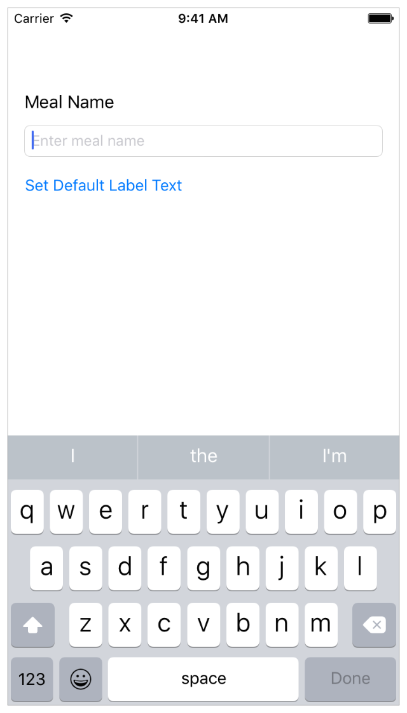

# 第三章：构建基础的用户界面
这章会带你熟悉用来写应用的工具－－Xcode。你将会熟悉Xcode中的项目结构，学会如何在导航之间跳转以及学会使用基本的项目组件。这一整章中，你将会开始为FoodTracker应用创建一个简单的用户接界面（UI,user interface），并且让它在模拟器中显示出来。当你完成这些之后，你的应用（app）将会像下面这样：  
  

###学习目标
在本章的最后，你将会学习到以下知识：
* 在Xcode中创建一个工程
* 认识在创建Xcode项目时，主文件中的样板方法
* 在项目中打开和切换文件
* 在模拟器中运行应用
* 在Storyboard中增加、移除和调整用户界面
* 使用属性检查（Attributes inspector）在Storyboard中编辑用户界面元素的属性
* 使用轮廓视图（outline view）浏览和重新排列storyboard中的用户界面
* 使用预览助手编辑器（Preview assistant editor）预览storyboard中的用户界面
* 使用自动布局（Auto Layout）布局能够自动适应用户设备尺寸大小的用户界面

###创建一个新工程
Xcode内置了几个应用模版，如游戏、基于触摸的导航应用和基于表格视图的应用，用来辅助开发普遍类型的iOS应用。这些模版大多数都有预先配置好的用户界面和源代码文件。在本章中，你将会从最基本的模版－－单页应用开始。  

创建一个新工程的步骤：  
1. 在/Application目录中打开Xcode（这将会出现Xcode的欢迎界面）  

如果你的界面不是欢迎界面的样子，不用担心－－你的Xcode可能在之前创建或打开过项目。你只需要在下一步中使用菜单选项即可创建工程。 
2. 在欢迎界面中，点击“Create a new Xcode project”（或者选择 File > New > Project）。Xcode将会打开一个新的窗口，并且显示一个对话框。在这个对话框中，选择一个模版。  
3. 在对话框左边的iOS区域中，选择Application。
4. 在对话框的主区域里，点击Single View Application，然后点击Next。

5. 在显示的对话框中，使用下面的值命名你的应用，并为你的应用选择其它合适的选项。 
* Product Name: FoodTracker
Xcode将会使用你输入的这个名字命名你的工程和应用。
* Organization Name: 你的组织的名字或者你自己的名字。你可以把这项留空。
* Organization Identifier: 你的组织的标识，如果你有的话，就如实填写；如果没有，可以使用com.example。
* Bundle Identifier：这个值是基于你的Product Name和Organization identifier自动生成的。
* Language：Swift
* Devices： Universal
一个通用（Universal）的应用可以同时在iPhone和iPad上运行。
* Use Core Data：不选。
* Include Unit Tests： 选上。
* Include UI Test：不选。


6.点击Next    
7.在显示出来的对话框中，选择你要保存这个工程的位置，然后点击Create。
Xcode将会在工作区窗口（workspace window）中打开你的新工程。


在工作区窗口中，你有可能会看到这样的一条警告消息：“No code signing identities found.”。这条警告的意思是，你还没有为iOS开发安装Xcode，但是不用担心，你可以在无视它的情况下完成这些课程。

###熟悉Xcode
Xcode涵盖了所有你想创建一个应用所需要的东西。它不仅帮你组织好创建一个应用所需要的代码，还为代码和视图元素提供了编辑器，允许你打包你的应用，同时还包含了一个强大的集成调试器。  

要熟悉Xcode工作区中的主要的区域，你需要花费一点时间。你将会在整个教程中使用到下图窗口中标记的区域。不要这些东西打击，因为当你需要使用到的时候，每一个区域都会做详细的描述的。  
 

###运行模拟器
因为你是基于Xcode的模版建立项目的，所以基本的应用环境会自动地为你设置。即便你还没有写任何的代码，你也可以在没有额外的配置的情况下编译和运行你的单页应用模版。  

使用Xcode中的模拟器（Simulator）可以运行你的app。模拟器能够让你知道当应用在实际设备中运行时，整个应用的外观以及行为。  

模拟器能模拟不同的硬件设备类型－－不同屏幕大小的iPad和iPhone等。所以你可以在你开发的平台的设备中模拟你的应用。在本教程中，使用iPhone6作为模拟器。  

**运行你的app的步骤：**  
1. 在Xcode工具栏的弹出式Scheme菜单中，选择iPhone6.
这个弹出式的Scheme菜单能让你选择各种模拟器或设备，以运行你的app。确保你选择的是iPhone6模拟器，而不是iOS Device（设备）。

2. 点击位于Xcode工具栏左上角的 Run 按钮。   
  
除此之外，你也可以选择 Product > Run (或者使用键盘Command-R)来运行。
如果你是第一次运行app,Xcode会询问你是否愿意在你的Mac上启用开发者模式。开发者模式(developer mode)允许Xcode在访问某一个特性的时候，不需要每次都输入你的密码。你可以		决定是否启用开发者模式，在提示框中做出你的选择。

如果你选择了不启用开发者模式，你可能会在之后被询问密码。本教程中假定开发者模式是开启的。
3. 在Xcode工具栏中查看编译完成的过程。
Xcode会在工具栏中间的活动视图（Activity viewer）中显示编译过程的信息。   

Xcode编译项目完成后，会自动启动模拟器。第一次启动的时候，可能需要花费一点时间。  

模拟器在你指定的iPhone模式下打开。在模拟的iPhone窗口，模拟器将会启动你的app。在app完成启动之前，你将会在启动窗口中短暂地看到你的app的名字，FoodTracker。  
  

然后，你应该会看到像下面这样的界面。  
  

现在，这个单页应用模版还没有做什么工作－它只是显示一个白屏。其它模版会有更复杂的行为。在扩展你的app的之前，理解一个模版的使用是非常重要的。在没有做任何修改之前运行你的app，是开始开发应用时的一个很聪明的做法。  

通过选择 Simulator > Quit Simulator (或者按下键盘Command-Q)退出模拟器。  

###查看源代码
这个单页应用模版附带了一些源代码文件来建立应用环境。首先，看一看AppDelegate.swift文件。  

**查看AppDelegate.swift文件源码**  
1. 确保工程导航在导航区是打开的。   
工程导航(project navigator)显示了你工程的所有文件。如果工程导航没有打开，		则点击最左边的导航条按钮。(除此之外，还可以选择 View > Navigators > Show 		Project Navigator)

2. 如果必要，通过点击工程导航栏里的FoodTracker文件夹旁边的三角形来打开		FoodTracker文件夹。  
3. 选择AppDelegate.swift文件。  
Xcode将会在窗口的主编辑区中打开该文件的源代码。  
  
除此之外，你还可以通过双击AppDelegate.swift文件，在新的窗口中打开它。

###App Delegate(应用代理)源文件
AppDelegate.swift文件包含两个主要的功能：  
* 它在你的app中创建了入口和一个分发输入事件的运行循环（run loop）。这个工作是通过UIApplicationMain属性（@UIApplicationMain）完成的；这个属性位于该文件内容的上方。UIApplicationMain创建了一个应用对象（application object）管理app生命周期，同时也会创建一个应用代理（app delegate）对象—这个对象在下面会作描述。 
* 它创建了一个描述这个app代理对象的蓝图的AppDelegate类。App代理会创建一个绘制app内容和提供响应app内状态改变的窗口，而AppDelegate类是你写定制的app层级代码的地方。 

AppDelegate类包含一个独立地属性：window。通过这个属性，app代理能够跟踪绘制了所有app内容的窗口。Window属性是一个可选值，也就是说在某些情况下，它可能没有值（nil）。  
```
var window： UIWindow？
```

AppDelegate类同样包含了一些重要方法的实现模板。这些预定义的方法允许应用对象（application object）和app代理对话。  

```
func application(application: UIApplication, didFinishLaunchingWithOptions launchOptions: [NSObject: AnyObject]?) -> Bool
func applicationWillResignActive(application: UIApplication)
func applicationDidEnterBackground(application: UIApplication)
func applicationWillEnterForeground(application: UIApplication)
func applicationDidBecomeActive(application: UIApplication)
func applicationWillTerminate(application: UIApplication)
```
在app状态改变的时候—比如，app启动、转至后台运行、终止等，应用对象会调用app代理中的响应方法，使得它能够有机会做出合适的响应。你不需要做任何特别的事情来确保这些方法在正确的时间调用—应用对象会为你做这部分的处理工作。  

每一个这些自动实现的方法都有一个默认的行为。如果你保持这些模板实现为空或者从AppDelegate类中把它们删除，那么在这些方法调用的时候，你都会得到它们默认的行为。在这些方法调用的时候，使用这些方法模板来增加的自定义代码也会得到执行。在本教程中，你不会使用到任何自定义的app代理代码，所以你不必改动AppDelegate文件。  

###视图控制器源文件 
单页应用模板还有另外一个源码文件：ViewController.swift。在工程导航中选择ViewController.swift可以查看该文件。 

 

这个文件定义了一个自定义的UIViewController的子类，名字为ViewController。现在，这个类只是简单地继承了UIViewController中定义的行为。要重写或者扩展这些行为，你需要重写在UIViewController中定义的方法（正如你在ViewController.swift文件中看到的viewDidLoad()和didReceiveMemoryWarning()方法所做的一样），或者实现你自定义的方法。   

虽然这些模板中存在didReceiveMemoryWarning()方法，但是在本教程中，你不需要对其做任何的实现，所以你尽管删掉它。  

到此，你的ViewController.swift代码看起来应该像下面这样： 
```
import UIKit

class ViewController: UIViewController {

override func viewDidLoad() {
super.viewDidLoad()
// Do any additional setup after loading the view, typically from a nib.
}

}
```

在稍后的教程中，你将会开始在这个源码文件中写代码。  

###打开你的Storyboard  
你即将开始在你app的storyboard中进行工作。Storyboard是你app的用户界面的可视化呈现工具，它能展示内容界面和在内容界面之间的切换关系。使用storyboard可以对app进行布局以驱动你的app。在你构建界面的时候，你将会清晰地看到你正在构建的东西，得到对于你正在做的东西的即时的反馈，同时能够马上看到你对用户界面的更改。   

**打开你的storyboard** 
* 在工程导航中，选择Main.storyboard。
Xcode会在界面设计器（Interface Builder）中打开storyboard。界面设计器是Xcode的可视化界面编辑器，位于编辑区中。Storyboard的背景是一块画布（canvas）。你可以使用这个画布增加和布局UI元素。 
你的storyboard看起来应该像这样： 

 

这时候，你的app中的storyboard包含了一个场景（scene），这个场景展示了你app中一屏幕的内容。画布中，指向场景左边的箭头是storyboard的入口（entry point），其表示当app启动的时候，这个场景是第一个被加载的。现在，你在画布中看到的场景包含了一个被视图控制器管理的单个视图。你很快将会学习到更多关于视图和视图控制器的作用方面的知识。  

当你在iPhone6模拟器中运行你的app的时候，该场景中的视图就是你在设备界面中看到东西。但是，当你在画布中看这个场景的时候，你会意识到它没有iPhone6屏幕的准确尺寸。这是因为在画布中的场景是通用的，它能够适用于所有的设备和方向。你可以使用这个特性创建一个自适应的界面---自适应界面能够根据当前的设备和方向，自动地调整界面以使其友好地显示。  

###创建基础的UI
现在是时候构建基本的界面了。你将会为你的食谱app—FoodTracker创建一个UI，它能允许你在你的app上添加一条食谱。  

Xcode提供了一个对象库，通过这个库你可以添加一个storyborad文件。这个库中的一部分是能在用户界面中显示的元素，比如按钮（buttons）和文本框（text fields）。另外一部分如视图控制器（view controllers）和手势识别器（gesture recognizers）只是定义你的app的行为而不会在屏幕中显示。 

在UI中显示的元素就是总众所周知的视图(views)。视图为用户显示需要的内容，其是构建你的UI的基础块，并以一种清晰的、优雅的、实用的方式呈现你的内容。视图有很多内置的实用的行为，包括在屏幕中显示它们自身，以及响应用户的输入。

在iOS中，所有的视图对象都是UIView或者其子类。很多UIView的子类在外观和行为上是高度定制的。在你的场景（scene）中，从添加一个UIView子类的文本框（UITextField）开始你的构建工作。 文本框能够让用户输入一段单行的文本，而这段文本将会作为你食谱的名字。

**添加一个文本框到你的场景中**  
1. 打开对象库(Object library)。  
对象库位于Xcode右侧工具区的下方。如果你没有看到对象库，可以点击库选择条下从左算起的第三个按钮。（另外一种方式：选择 View > Utilities > Show Object Library.） 

  

在出现的列表中，显示了每一个对象的名字，描述和可视化的图标。  
2. 在对象库中，在筛选区输入text field快速查找文本框对象。    
3. 从对象库中拖动一个文本框对象到你的场景（scene）中。

如果有必要，通过选择 Editor > Canvas > Zoom 来进行缩放。
4. 拖动文本框使其位于场景的上半部分，并使其和左边界对齐。
当你看到如图所示的效果的时候，停止拖动。

蓝色的布局辅助线能帮助你放置文本框。布局辅助线只有当你拖动或者改变对象尺寸的时候才会出现；当你释放了文本框的拖动的时候，这些辅助线会消失。
5. 如果有必要，可以点击文本框以显示用于调整尺寸的控制点。
你可以通过拖动文本框的调整尺寸的控制点来实现对UI的尺寸调整。控制点位于元素的边框上，外观上是一些白色的小正方形。当你选择了文本框的时候，这些白色的小正方形就会出现。在这种情况下，文本框应该已经选上了，因为你刚刚才把它拖动完成。如果你的文本框像下面这个一样，你就可以对它进行调整大小了；否则，你应在画布上先选上它。 
 
6. 调整文本框的左右边界，直到你看到三条垂直方向的布局辅助线：左对齐，水平居中对齐，右对齐。 

虽然你已经在场景中放置好文本框了，但是对于这个文本框应该输入什么内容，还没有任何的指示提供给用户。使用文本框的占位符（placeholder）可以提示用户输入一个新食谱的名字。 

###配置文本框占位符文本 
1. 选中文本框后，打开工具去的属性检查面板。  
当你点击了选项条中从左到右算起的第四个按钮之后，就会出现属性检查面板，它能让你编辑storyboard中对象的属性。  

2. 在属性检查面板中，找到 Placeholder 标签的区域，输入“Enter meal name”。
3. 按下Return，在文本框中就会显示新的占位符文本。

现在，你的场景应该像下面这样：  
  

当你在编辑文本框的属性的时候，你还可以在用户选择文本框的时候，更改系统默认键盘。 

###配置文本框对应的键盘类型
1. 确保文本框仍在选中状态。
2. 在属性检查面板中，找到Return Key标签所在的域，选择 Done。  
把它改成 Done 之后，这个更改能让键盘上的 Return 键更加突出。
3. 在属性检查面板，勾选上 Auto-enable Return Key。  
这个更改会让文本框在用户输入文本之前，禁用Done键，确保用户不会输入一个空的食谱名字。 

接下来，添加一个标签(UILabel)到场景的上方。标签是没有交互的，它只是单纯地在UI中显示静态的文本。为了帮助你理解如何定义在UI中元素的交互，你将会让这个标签以使其显示用户在文本框中输入的内容。这是一个很好的方法，用以检测文本框正确地处理用户的输入。 

###在你的场景中添加一个标签
1. 在对象库的搜索框中，输入label以快速查找Label对象。
2. 从对象库中，拖动label对象到你的场景中。
3. 拖动标签使其位于文本框的上方并使其向左对齐。 
当你看到像下面这样的效果时，停止拖动。 

4. 属性这个标签，并输入Meal Name。
5. 按下Return键，标签中就会显示新的文本。 

你的场景应该像下图这样： 


现在，在你的UI中添加一个按钮(UIButton)。按钮是可交互的，所以用户可以点击它并触发你定义的行为。稍后，你将会创建一个行为用以重设标签的值为默认值。

###在你的场景中添加一个按钮
1. 在对象库的搜索框中，输入 button 以快速地查找Button对象。
2. 从对象库中拖动一个Button对象到你的场景中。
3. 拖动该按钮对象，使其位于文本框的下方，并使其左对齐。   
当你看到像下面这样的效果时，停止拖动。 

4. 双击该按钮，并输入Set Default Label Text。
5. 按下Return键，按钮中就会显示新的文本。  

至此，你的场景应该像下面这样： 


理解你在场景中添加的元素如何布局是很有用的。通过结构图，查看你在场景中所添加的UI元素。  

###查看结构图 
1. 在你的storyboard中，找到结构视图切换按钮。 

2. 如果结构视图已经折叠起来，可以点击切换按钮以展开结构视图。 
你可以根据需要，通过这个切换按钮以折叠或展开结构视图。 

结构视图位于画布的左边，它展示了你的storyboard中对象的结构层次。你应该能看到刚刚添加到storyboard中的文本框，标签，和按钮。但是，为什么你添加到其中的元素被包含在view中？也就是说，在另外的一个视图中？ 

视图不仅仅在屏幕中显示它们自身，它们还可以响应用户的输入，可以作为其它视图的容器。视图在层次结构中的排列称为视图层次（view hierarchy）。视图层次定义了视图与视图之间的关系。在视图层次内部，被另外一个视图包含的视图称为子视图（subview），而包含别的视图的视图称为这些视图的父视图。一个视图可以有多个子视图，而只能拥有一个父视图。   

 

通常来说，每一个场景会有自己独有的视图层次。每一个视图层次的上方是内容视图（content view）。在上图的场景中，内容视图是一个View，它是视图控制器的顶层视图。文本框，标签和按钮是内容视图的子视图。你放置到场景中所有其它的视图都将会是这个内容视图的子视图（尽管它们本身可以被包含在其它子视图中）。 

###预览界面 
周期性地预览你的app，确保所有的东西都像你期望的那样。你可以使用辅助编辑器（assissant editor）预览app界面。辅助编辑器是一个备用的编辑器，其跟主界面并排地显示。 

**预览界面**  
1. 在Xcode中，点击位于右上角工具条中的Assisstant按钮，以打开辅助编辑器。   

2. 如果需要更多的工作空间，你可以通过点击在Xcode工具栏中的Navigator和Utilities按钮隐藏工程导航栏和工具区。 
  
除此之外，你还可以将轮廓视图隐藏。   
3. 在位于辅助编辑器上方的编辑器选项条中，把辅助编辑器从 Automatic 切换到 Preview > Main.storyboard。  
 
如你在辅助编辑器中看到的，这个文本框看起来不大准确，它向右溢出了边界。但是，你在storyboard中看到的界面是正常的，为什么在iPhone的预览下就不正常了呢？  

在这之前，你已经知道你其实创建的是一个自适应的界面，这个自适应的界面会在不同尺寸的iPhone和iPad下进行缩放。你在storyboard中看到的默认的场景展示的是你所设计的界面的通用版本。这里，你将需要指定界面在不同的屏幕尺寸下应该如何进行自适应。例如，当界面缩小到一个iPhone尺寸时，这个文本框应该也同时缩小。当界面放大到一个iPad的尺寸时，这个文本框也应该随着放大。你可以通过自动布局（Auto Layout），很简单地指定这些种类的界面。 

###采用自动布局(Auto Layout)
自动布局是一个强大的布局引擎，它能帮助你毫无压力地设计自适应的布局。你只需要为场景中需要定位的元素描述你意图，让布局引擎决定如何最完美地实现你的意图。你将会使用约束（constraits）表达你的意图，而约束是一些布局规则，其能解释一个元素相对于另一个元素如何定位，描述尺寸大小，或者当某些东西减少了两个元素的可用空间的时候，这两个元素应该如何缩小。  

和自动布局相伴而生的其中一个非常有用的工具是堆视图（stack view，UIStackView），它能辅助你处理自动布局。堆视图提供一个流线型的界面，用以在一个行或者列上布局一个视图的集合。堆视图能让你利用自动布局的能力，创建能动态适应设备方向，屏幕尺寸和任何可用空间的改变的用户界面。 

你可以很简单地把你现有的界面包在一个堆视图中，通过添加必要的约束使堆视图在不同的情形状下正确地显示。 

**在食谱场景中添加自动布局约束** 
1. 通过点击Standard按钮返回到标准编辑器中。 

通过点击在Xcode工具栏中的Navigator和Utilities按钮，展开工程导航和工具区。
2. 在你的键盘中按下Shift键的时候，选择文本框（text field），标签（label）和按钮（button）。

3. 在画布的右下角，点击 Stack 按钮。（除此之外，也可以选择 Editor > Embed In > Stack View）。 

Xcode会这些UI元素包在一个堆视图中，把它们堆在一起。Xcode会分析你现有的布局，计算出这些元素应该在纵向堆叠，而不是横向。

4. 如果有必要，可以打开轮廓视图，然后选择 Stack View 对象。
   
5. 在属性检查器中，在 Spacing 框中输入12，然后按下回车。 
你将会看到这些UI元素在纵向铺展开，而这个堆视图也同样被放大了。 

6. 点击位于画布右下方的Pin，打开Pin菜单。  

7. 在“Spacing to nearest neighbor”上方，通过点击水平的两个和上面纵向的一个约束以选上它们。选上后，它们会变成红色。 
  
这些约束表明了相对于左、右和顶部近邻元素的间距。在这个上下文中，近邻的情况表示最接近自身的元素的边界，这可能会是父视图，同级视图，或者是一个边距。因为“Constrain to margins”选框已经选上了，所以这个堆视图在这种情况下将会约束它的父视图的左、右和上边距，从屏幕的边界中预留少量的空间。 
8. 在左右框中分别输入0，在上方框中输入60。
9. 在弹出的Update Frames旁边，选择Items of New Constraints。  
这个Pin菜单看起来应该像这样：
 
10. 在Pin菜单中，点击Add 3 Constraints按钮。 
     
这个食谱UI看起来应该像这样： 
 
你会发现文本框没有像之前那样伸展到场景的边缘，所以你稍后将会修复这个问题。  

**调整食谱场景中的文本框宽度**  
1. 在你的storyboard的食谱场景中，选上文本框。   
2. 在画布的右下方，打开Pin菜单。  
  
3. 在“Spacing to nearest neighbor”中，点击两个水平的约束以选上它们。选上后，它们会变成红色。 
4. 在左右两个框中，输入0。
5. 在弹出的Update Frames旁边，选择Items of New Constraints。  
这个Pin菜单看起来应该像这样： 
 
6. 在Pin菜单中，点击Add 2 Constraints按钮。 
  
7. 选上文本框后，在工具区中打开尺寸检查（Size inspector）。  
当你选上检查器选条中的第五个按钮后，尺寸检查器将会出现。它能让你编辑storyboard中对象的尺寸和位置。 
 
8. 在Intrinsic Size框中，选择Placeholder。（这个框位于尺寸检查器的最下方，所以你需要滚到下方。）       
文本框是基于它们自身的内容确定大小的，这些内容定义了它们的固有的内容尺寸（intrinsic content size）。固有的内容尺寸表明在视图中显示所有内容需要的最小尺寸。如果你需要为不容的尺寸设计一个UI，你可以指定UI元素一个占位的固有的内容尺寸。现在，这个文本框的内容是它的占位符文本，但是用户输入的实际文本可能比这个更长。 

现在这个食谱场景的UI看起来应该像这样： 
 

检验成果：在模拟器中运行你的app。这个文本框应该不会溢出屏幕的边界了。你应该可以点击文本框并使用键盘输入文本（如果你喜欢，可以通过按下Command－K弹出软键盘）。如果你翻转设备（command ＋ 左箭头或者command ＋ 右箭头），或者在一个不同的设备中运行app，文本框将会根据设备的方向和屏幕大小放大或者缩小文本框。注意，在横屏的时候，状态条会消失。 
 

如果你没有得到预料中的结果，可以使用自动布局调试功能来帮助你。点击“Resolve Auto Layout Issues”图标，然后选择“Reset to Suggested Constraints”让Xcode通过一个有效的约束集来更新你的界面。或者点击“Resolve Auto Layout Issues”然后选择“Clear Constraints”以移除UI元素上所有的约束，之后再尝试一遍上面的步骤。 
 

虽然这个场景还没有太多东西，但是已经搭建了基础的用户界面和功能了。确保你的布局在一开始就是健壮和可拓展的，以保证你有一个坚实的基础来继续添砖加瓦。

